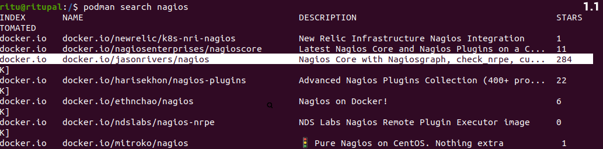
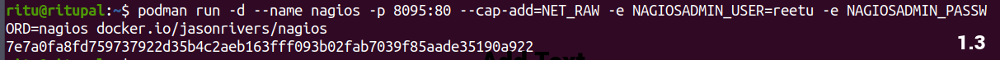

<u><h1 style="text-align:center"> NAGIOS</h1></u>
Nagios is an open source continuous monitoring tool which monitors network, applications and servers. It gives the complete status of your IT infrastructure and its performance.

In case of any failure, Nagios alerts about the issues, so that the technical team can perform recovery process immediately.

Otherwise, application or server may be down.

<u><h3
style="text-align:center">Advantages of Nagios </h3></u>

- Detect all types of network or server issue.
- It helps you to find the root cause of the problem which allow you to get permanent solution to the problem.
- Reduce downtime.
- Active monitoring of entire infrastructure.
- Allow you to monitor & troubleshoot server performanance issues.
- Automatically fix problem.
   
<u><h3 style="text-align:center">How does it works </h3></u>

- Mention all details in configuration file. - Daemon read those details what data to be collected.
- Daemon use **NRPE** (Nagios Remote Plugin Executor) plugin to collect data from nodes & store in its own database.
- Finally, shows in dashboard.
  
<u><h1 style="text-align:center">Installation of Nagios in Ubuntu 20.04 </h1></u>

<u><h2 >Environment details </h2></u>
**OS**- Ubuntu 20.04</br>
**CPU**- 8 Core</br>
**STORAGE**- 1 TB</br>

<u><h2 >Tool used </h2></u>

- podman version (3.4.2)
- Nagios version (4.4.8)
  
<u><h3 >Here are some steps for installing nagios in container: </h3></u>

##### Command 1:-
This command is used for installation of podman.
```
apt install -y podman
```
##### Command 2:-
This command will query the default container registry (usually Docker Hub) and return a list of container images with "nagios" in their name or description.
```
podman search nagios
```

**Podman:** It is the name of the containerization tool.</br>
**Search:** It is a subcommand in a podman tool, it indicates that you want to search for container image images in container registry.</br>
**nagios:** It is search term or query,here I am  looking for container images related to the Nagios monitoring tool.</br>

##### Command 3:-
This comand is used to pull the nagios container image from docker hub to your local system using podman.
```
podman pull docker.io/jasonrivers/nagios  
```


**podman pull:** It tells your computer to download something.</br>
**docker.io:** It's the location on the internet where we want to get something.</br>
**jasonrivers/nagios:** This specifies exactly what we want to download, in this case, it's a tool or application called "nagios."


##### Command 4:- 
This command will start the Nagios container with the specified options. You can access the Nagios web interface by opening a web browser and navigating to http://localhost:8095/nagios.</br> 
In this command I added my username and password also otherwise nagios will give you default username and password.

```
 podman run -d --name nagios -p 8095:80 --cap-add=NET_RAW -e NAGIOSADMIN_USER=reetu -e NAGIOSADMIN_PASSWORD=nagios docker.io/jasonrivers/nagios
 ```


**podman run:** It tells your computer to start running something in a container.

**-d:** It stands for "detached mode." This means that the container will run in the background, and you'll get your command prompt back.

**--name nagios:** This gives your container a name, in this case, "nagios." It's like giving it a label so you can refer to it easily.

**-p 8095:80:** This maps port 8095 on your computer to port 80 in the container. So, when you access port 8095 on your computer, it's like talking to port 80 in the container.

**--cap-add=NET_RAW:** This adds the capability to send and receive raw network packets. It's needed for certain network-related tasks.</br
                                                                                                                                          >
**-e NAGIOSADMIN_USER=reetu:** This sets an environment variable NAGIOSADMIN_USER inside the container to "reetu." It's like giving a piece of information to the container.

**-e NAGIOSADMIN_PASSWORD=nagios:** This sets another environment variable NAGIOSADMIN_PASSWORD inside the container to "nagios." It's like giving another piece of information to the container.

**docker.io/jasonrivers/nagios:** This is the name of the container image you want to run. It's like specifying which application or tool you want to use in the container.

##### Command 5 :-
 Check running container details by this command.
 ```
podman ps
```


**podman:** This is the command-line tool for managing containers.</br>
**ps:** This is a subcommand of podman that stands for "processes" or "list containers."

##### Command 6:-
This command is used for going into the container and execute commands.
```
podman exec -it nagios bash
```


**podman exec:** Exec is the sub command of podman used for executing a command inside a running container.</br>
**-it:** It allows you to run interactive commands inside containers while maintaining a terminal-like environment for a smooth interactive experience.</br>
**nagios:** This is the name of the container where you want to execute the command. It specifies which container to enter.</br>

**bash:** This is the command you want to run inside the container. In this case, you are starting a Bash shell inside the container. Bash is a command-line shell that allows you to interact with the container's file system and execute commands within it.

##### Command 7:-
By this command, I am telling my computer to change my current working directory to the /opt/nagios/etc directory.

```
cd /opt/nagios/etc
```


**cd:** This is a command that stands for "change directory." It is used to navigate or move to a different directory (folder) in the file system.</br>

**/opt/nagios/etc:** This is the path or location you want to change your current directory to. In this case, you are specifying the directory /opt/nagios/etc as the target directory.</br>

##### Command 8:-
```
ls
```


##### Command 9:-
This command is used  for editing in file.

```
vim cgi.cfg
```

Go to the cgi.cfg file and add your username which you have mentioned in run command.</BR>


**vim:**


Type **localhost:8095** on web page and then you can see preview on web interface.</br>

 

#### Checking services
We have to go on left side and click on the service option.
This is the dashboard of all services.</br>


 


